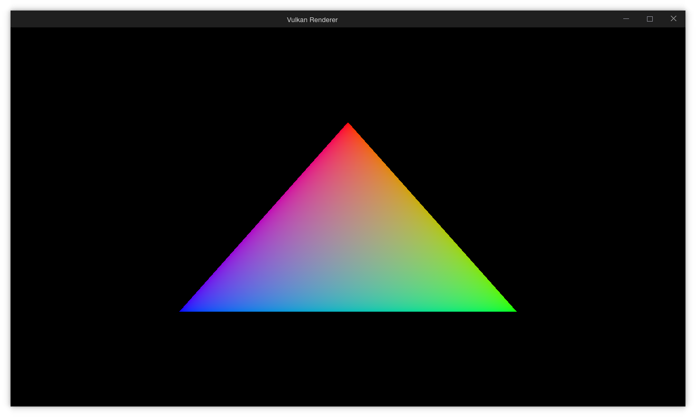

# Vulkan Sandbox

This is where I will experiment with the Vulkan graphics API. The plan is to
start by following [Vulkan Tutorial](https://vulkan-tutorial.com/) to build up a
foundation. Then, after completing the tutorial, I will modify the code with the
aim to produce a basic 3D renderer. The scope of the 3D renderer will be decided
at a later point.

# Requirements

This project has only been tested on Linux, but should work on other platforms.
Windows in particular may require changes to CMakeLists.txt and/or adding flags
during the configure stage.

| Dependency                               | Minimum Version | Version Used by Me      |
| ---------------------------------------- | --------------- | ----------------------- |
| A C++ compiler with C++20 support        | `-`             | `11.1.0 (clang)`        |
| [CMake](https://cmake.org/download/)     | `3.0.0`         | `3.20.0`                |
| [Vulkan SDK](https://vulkan.lunarg.com/) | `1.0`           | `1.2.173`               |
| [GLFW](https://www.glfw.org/)            | `3.0.0`         | `3.3.3 (glfw-x11)`      |

# Progress Preview

