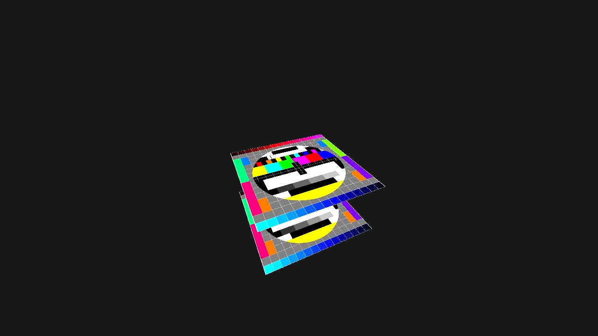
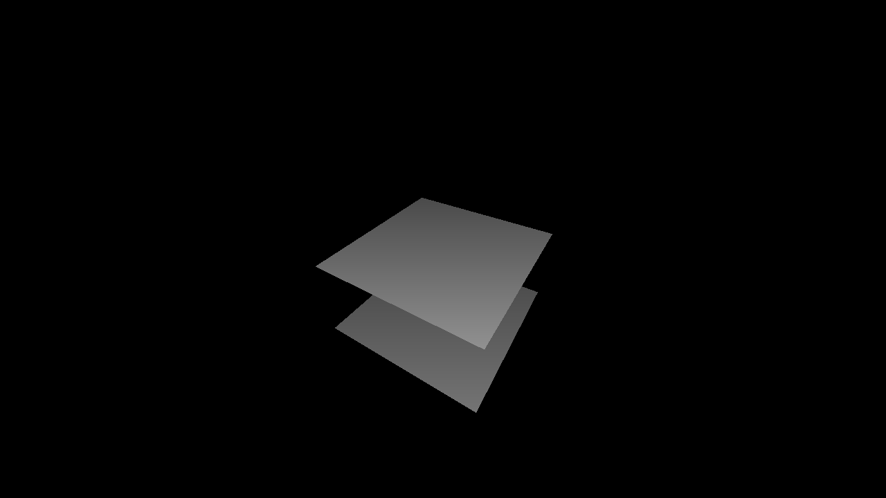

# Vulkan Sandbox

This is where I will experiment with the Vulkan graphics API. The plan is to
start by following [Vulkan Tutorial](https://vulkan-tutorial.com/) to build up a
foundation. Then, after completing the tutorial, I will modify the code with the
aim to produce a basic 3D renderer. The scope of the 3D renderer will be decided
at a later point.

# Development Branches

The main branch may not contain the latest changes, as risky changes are kept in
separate development branches prior to merging. These branches are named
`wip/{feature}`.

# External Dependencies

This project uses vcpkg to pull in most dependencies. However, the following must
still be installed manually:

| Dependency                                         | Version Used in Project |
|----------------------------------------------------|-------------------------|
| A C++ compiler with C++23 support                  | `15.0.5 (clang)`        |
| [vcpkg](https://github.com/microsoft/vcpkg) itself | -                       |
| [CMake](https://cmake.org/download/)               | `3.24.0`                |
| [Vulkan SDK](https://vulkan.lunarg.com/)           | `1.3.236`               |

# Project Setup

This project has only been tested on Linux and Windows 10. Other platforms may or
may not also work.

## Clone the Repository
```
git clone --recurse-submodules {repo}
```

## Configure CMake
There are currently two compilers (MSVC, Clang) and two build configurations (Debug, Release) with presets.

The presets are named `{Compiler}-{Configuration}`, with each component spelled exactly as above.

```
cd {projectRoot}
cmake --preset {preset}
```

## Build
```
cmake --build Build/{preset}
```

## Run
```
{projectRoot}/Build/{preset}/Renderer --resources-path="{ABSOLUTE_PATH_TO_RESOURCES_DIR}"
```

The "--resources-path" flag is necessary during development since the
Resources directory and the executable will not be in the same directory. Note
that the quotes are required.

If using CLion, you can take advantage of the `$ProjectFileDir$` macro in
Run/Debug Configurations &rarr; Program arguments.

# Progress Preview



Reversed depth buffer visualisation:

