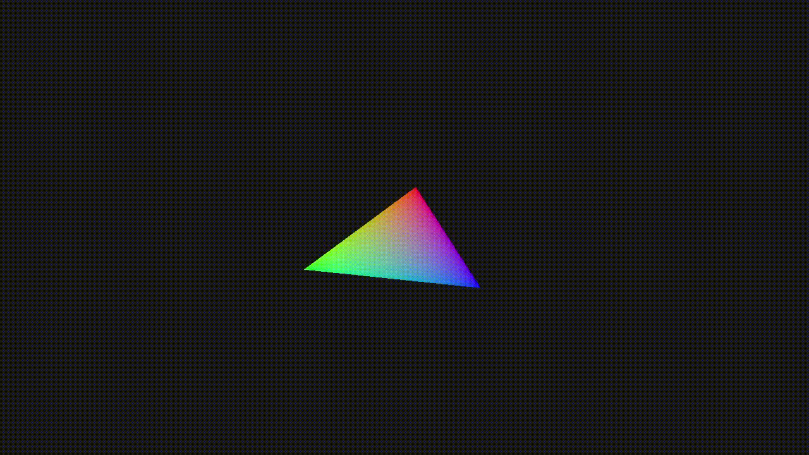

# Vulkan Sandbox

This is where I will experiment with the Vulkan graphics API. The plan is to
start by following [Vulkan Tutorial](https://vulkan-tutorial.com/) to build up a
foundation. Then, after completing the tutorial, I will modify the code with the
aim to produce a basic 3D renderer. The scope of the 3D renderer will be decided
at a later point.

# External Dependencies

This project uses vcpkg to pull in most dependencies. However, the following must
still be installed manually:

| Dependency                               | Version Used in Project |
|------------------------------------------|-------------------------|
| A C++ compiler with C++20 support        | `13.0.1 (clang)`        |
| [CMake](https://cmake.org/download/)     | `3.23.0`                |
| [Vulkan SDK](https://vulkan.lunarg.com/) | `1.3.211`               |

# Progress Preview

